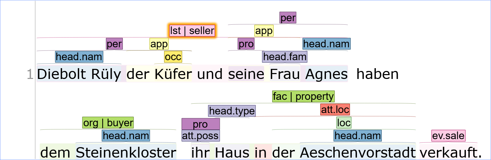
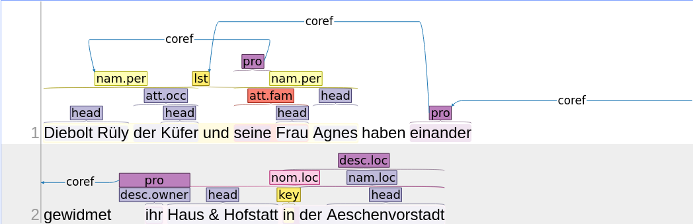

# 1. Einführung

## 1.1. Grundlage
BeNASch basiert auf den Automatic Content Extraction 2005 - Guidelines, ein Standard, der im Bereich der Informationsextraktion von modernem Englisch üblich ist. BeNASch hat viele Anpassungen erfahren, wo aber etwas unklar sein sollte, können die Anweisungen in [[ACE2005]](https://www.ldc.upenn.edu/sites/www.ldc.upenn.edu/files/english-entities-guidelines-v5.6.6.pdf) aushelfen.

## 1.2. Motivation
Diese Richtlinien sollen eine einheitliche Annotation von Texten in vormodernem Deutsch ermöglichen, wobei semantische Informationen bezüglich relevanter Entitäten (Personen, Orte, Organisationen, etc.) und Beziehungen sowie Interaktionen zwischen diesen Entitäten extrahiert werden.

Computerlinguistisch gesprochen sollen die gegebenen Informationen das maschinelle Training für die folgenden Informationsextraktions-Aufgaben ermöglichen:

-   Entity Detection
-   Named Entity Recognition
-   Coreference Resolution
-   Relation Extraction
-   Event Extraction

Das Ziel ist hierbei sowohl Konsistenz, wie auch Vollständigkeit. Konsistenz stellt unter anderem sicher, dass Annotator:innen keine Schwierigkeiten haben, sich für die richtige Annotation zu entscheiden, dies verschnellert auch den Annotationsprozess. Auch maschinengestütztes Lernen profitiert von konsistentem Trainingsmaterial. Das Ziel von BeNASch ist daher auch, Kompatibilität für computerlinguistische Analysen zwischen verschiedenen Editionen herzustellen.

## 1.3. Eckpunkte

### 1.3.1. Textnahe Annotation
Eine Faustregel für die Annotation in allen folgenden Kapiteln ist, dass wir möglichst textnah annotieren. Am leichtesten lässt sich diese Regel im Falle von Beziehungen demonstrieren. Haben wir einen Satz wie  "Hans ist der Bruder von Maries Ehemann." dann finden wir darin die Beziehung "Bruder" zwischen "Hans" und "Maries Ehemann", und eine "Ehe"-Beziehung zwischen "Marie" und "Ehemann", aber keine Beziehung "Schwager" zwischen "Hans" und "Marie". 

### 1.3.2. Hierarchische Typologien
Das Schema ist auf eine Weise geschrieben, die es ermöglichen sollte, unendliche Unterkategorien für jede Kategorie, z.B. zur Entitätenklassifikation, zu schreiben. Wir zielen in diesem Dokument darauf ab, eine solche Typologie vorzulegen,  und weitere Unterklassen, welche Projekte verwenden, dieser hinzuzufügen um möglichst grosse Kompatibilität mit späteren Projekten zu gewährleisten.

Verdeutlichen wir das an einem Beispiel mit der Beziehung vom Typ "Familie". Vielen Projekten würde diese grobe Einordnung der Beziehung zwischen zwei Personen ausreichen. Ein Projekt, für welches diese Beziehungen aber in grösserem Detail festgehalten werden müssen, würde eventuell feinere Kategorien wie "Ehe", "Geschwister", "Kinder", etc. festlegen. Diese würden dann alle "Familie" untergeordnet und diese Verbindung würde im Schema, oder zumindest in der Projektspezifischen Dokumentation (siehe 1.7.) festgehalten. Das würde Kompatibilität mit Projekten sicherstellen, welche die detaillierteren Unterscheidungen nicht verwenden.

## 1.4. Komplexität
BeNASch mag auf den ersten Blick überwältigend wirken. Es ist weitaus komplexer als eine traditionelle flache Named Entity Annotation und beansprucht auch mehr Zeit. Leider ist nur so das Ziel einer konsistenten, vollständigen Annotation zu erreichen. Um den Annotationsprozess zu beschleunigen, empfehlen wir, nicht alles ausführlich nach dem Schema zu annotieren, sondern "Abkürzungen" zu verwenden. Im Kapitel 5 geben wir praktische Tipps mit welchen Werkzeugen die Dokumente am schnellsten aus gängigen Formaten (Transkribus-Export, TEI) zu annotieren sind, und welcher "Abkürzungen" sich Annotator:innen bedienen können. Zudem stellen wir Post-Processing-Skripte bereit, mit welchen die "abgekürzten" Annotationen dann in das vollständige Schema umgewandelt werden können.

Für Projekte, welche keinen Wert auf eine vollständig BeNASch-konforme Annotation legen, stellen wir zudem Methoden vor, wie das Schema so reduziert werden kann, dass die eigenen Daten soweit kompatibel bleiben, wie möglich. _coming soon_

## 1.5. Vorverarbeitung des Textes
Die Vorverarbeitung des Textes sollte wie die Annotation einheitlich sein. Aus diesem Grund versuchen wir, möglichst wenig am Text zu ändern, der einzige Schritt, der zwingend durchzuführen ist, ist die [[Tokenisierung]](https://de.wikipedia.org/wiki/Tokenisierung). Hierbei geht es in erster Linie darum, Satzzeichen von Wörtern zu trennen, um eine saubere Annotation zu ermöglichen. Verwenden Sie das empfohlene Verfahren in der Anleitung, können Sie sich der dort vorgeschlagenen Tokenisierung bedienen.

Abkürzungen sollten möglichst aufgelöst und ohne weitere Markierungen (z.B. eckige Klammern) dargestellt werden.

## 1.6. Wörter als Basis-Einheit
In BeNASch wird auf Token-Basis annotiert. Dies deshalb, weil nur wenige maschinelle Annotationsalgorithmen zeichenbasierte Annotationen akzeptieren und die Annotation dadurch schneller möglich ist (Es ist schneller auf ein Wort zu klicken, also jedes mal die genauen Zeichen zu markieren).

## 1.7. Dokumentation
Wie schon erwähnt, empfehlen wir in diesem Schema neben den "Basis-Typen" auch optionale Typen. Um maximale Kompatibilität zu gewährleisten ist es wichtig, dass sich ein Projekt darauf einigt, welche optionale Typen es nutzen möchte (siehe Kapitel 6 für Empfehlungen). Die gewählten Typen müssen konsequent annotiert werden um Konsistenz in den Daten zu gewährleisten! Die Annotationsdokumentation des Projekts muss klar und verständlich festhalten, welche optionalen Typen annotiert wurden. Falls eines der Module in den Empfehlungen (_coming soon_) genutzt wurde, kann einfach das Modul festgehalten werden. In jedem Fall ist die Version des aktuellen BeNASch in der Dokumentation zu verzeichnen. (Versionierung beginnt bald)

## 1.8. Annotationsbeispiel
Anhand eines kurzen Textes demonstrieren wir hier die Grundlagen von BeNASch in zusammengefasster Form. Wir unterlassen hier manche weniger wichtigen Klassifikationen wie die Ordinalität, dieses Beispiel soll nur zur Einführung dienen. Es finden sich zudem Verweise und nach jedem Schritt ein Bild, wie die Annotation im von uns empfohlenen Workflow (auf der Plattform [[INCEpTION]](https://inception-project.github.io/)) zu handhaben wäre.

### 1.8.1. Ausgangstext
"Diebolt Rüly der Küfer und seine Frau Agnes haben dem Steinenkloster ihr Haus in der Aeschenvorstadt verkauft."

### 1.8.2. Entitäten
In diesem Text erkennen wir die folgenden Entitäten-Erwähnungen, mit ihren beschreibenden Elementen:

**Diebolt Rüly der Küfer**

| Element | Inhalt | Klasse |
| ------------ | ------------- | ------------- |
| Erwähnung | Diebolt Rüly der Küfer | *per* |
| Kern | Diebolt Rüly | *nam* |
| Apposition | der Küfer | - |
| Kern der Apposition | Küfer | *occ* |

- *per* klassifiziert eine Erwähnung als auf eine Person verweisend.
- *Diebolt Rüly* ist der Kern der Erwähnung. Alle Entitätenerwähnungen müssen genau eine Kern-Spanne aufweisen. Da der Kern hier ein Eigenname ist, erhält der Kern die Klasse Eigenname (*nam*).
- Bei *der Küfer* handelt sich um eine lockere Apposition, die wiederum einen eigenen Kern aufweist. Theoretisch können unendlich viele Appositionen verschachtelt sein. *occ* steht für *occupation*, die Apposition bzw. ihr Kern beschreibt also den Beruf von Diebolt Rüly.

**seine Frau Agnes**

| Element | Inhalt | Klasse |
| ------------ | ------------- | ------------- |
| Erwähnung | seine Frau Agnes | *per* |
| Kern | Agnes | *nam* |
| Apposition | seine Frau | - |
| Kern der Apposition | Frau | *fam* |

- *fam* für *family* bzw. eine Beschreibung durch eine Familienbeziehung.

**seine**

| Element | Inhalt | Klasse |
| ------------ | ------------- | ------------- |
| Erwähnung | seine | *per* |

- Diese Pronominalnennung bezieht sich auf Diebolt und ist insbesondere für die Beziehungsannotation relevant.

**dem Steinenkloster**

| Element | Inhalt | Klasse |
| ------------ | ------------- | ------------- |
| Erwähnung | dem Steinenkloster | *org* |
| Kern | Steinenkloster | *nam* |

- Eine neue Entitätenkategorie: *org* markiert Organisationen.

**ihr Haus in der Aeschenvorstadt**

| Element | Inhalt | Klasse |
| ------------ | ------------- | ------------- |
| Erwähnung | ihr Haus in der Aeschenvorstadt | *loc* |
| Kern | Haus | *typus* |
| Attribut | ihr | *owner* |
| Attribut | in der Aeschenvorstadt | *loc* |

- Eine neue Entitätenkategorie: *loc* markiert Orte, darunter auch menschengemachte Strukturen. Je nach Projekt, möchte man für diese aber eventuell eine Unterkategorie definieren und würde die Erwähnung mit *loc_fac* (Facility) annotieren.
- Der Kern hat eine neue Klasse: *typus* markiert Beschreibungen, bei denen über die Kategorie der Entität die Beschreibung erfolgt. Bei ORG und LOC ist diese Art der Nennung sehr häufig.
- Das *ihr* als Possessivartikel ist sowohl Attribut wie auch Entität (separat). Der Possessivartikel beschreibt hier ein Besitzverhältnis.

{: .note}
Wieso wurde oben der Possessivartikel *seine* nicht annotiert? Manche Attribute sind direkt mit der Bedeutung des Kerns verbunden. Ist das der Fall, wie z.B. das *seine* bei *seine Frau*, wird kein Attribut gesetzt, denn die Beziehung bzw. Information ist bereits durch den Kern gegeben.
Ein weiteres Beispiel wäre "Bürger zu Basel", bei dem kein Attribut um "zu Basel" gesetzt würde, da das ganze als Einheit gelesen werden muss.

- Hier sehen wir ein neues Element: Attribute. In diesem Fall ein Präpositionalattribut, welches den Ort des Hauses beschreibt. Daher die Klasse *loc* (Attributs-Klasse *loc*, nicht zu verwechseln mit der Entitätsklasse *loc*). Diese Klasse beschreibt nur grob die Beziehung zwischen dem Haus und der Aeschenvorstadt. Ein topologisch-interessiertes Projekt würde vermutlich eine Unterkategorie *loc_in* anlegen, um die Beziehung genauer aufzuzeichnen und abrufbar zu machen.

**ihr**

| Element | Inhalt | Klasse |
| ------------ | ------------- | ------------- |
| Erwähnung | ihr | *per, grp* |
| Kern | ihr | *pro* |

- Bisher haben wir die Kategorisierungen Ordinalität und Spezifität ignoriert, da alle Erwähnungen dem *default* entsprachen (einzeln, spezifisch). Da dieses Pronomen aber auf mehrere Personen verweist, erhält es die GRP-Klasse für Ordinalität.

**der Aeschenvorstadt**

| Element | Inhalt | Klasse |
| ------------ | ------------- | ------------- |
| Erwähnung | der Aeschenvorstadt | *loc* |
| Kern | Aeschenvorstadt | *nam* |

**Annotationsbeispiel**

In der Praxis können wir uns viel Aufwand sparen. Das annotierte Dokument kann durch unser Postprocessing-Framework mit allen notwendigen Informationen ergänzt werden (z.B. *default*-Werte nachtragen). Durch eine config-Datei können auch eigene gewünschte Verhaltensmuster bis zu einem gewissen Grad festgelegt werden. Für das folgende Beispiel nehmen wir z.B. an, dass unsere config-Datei eine Klasse *fac* immer zu *loc_fac* ergänzt, um uns ein paar Tipper zu ersparen.

Bemerke, dass wir Pronomina abgekürzt annotieren, weil sie ihre weiteren Klassifikationen später anhand der Koreferenzen ablesen können. Wir annotieren auch keine Kerne, wenn sie mit der Erwähnungsspanne komplett übereinstimmen würden und hängen ihre Klasse einfach an die Entitätsklasse an.

### 1.8.3. Einfache Beziehungen
Beziehungen sind in weiterem Sinne Zustände (Kapitel 4), die ein Verhältnis zwischen mehreren Entitäten beschreiben.
Wie wir genau Beziehungen annotieren, wird in der Projektdokumentation spezifiziert. Nehmen wir an, dass wir uns für
die in diesem Teil folgenden Beziehungen, *fam*, *owner* und *loc*, auf eine einfache Annotation festgelegt haben, in der wir
nur die jeweiligen teilnehmenden Entitäten (Rollen) annotieren.
Die Textstrings hier beziehen sich auf die in 1.8.2. definierten Erwähnungen:

**seine Frau -- seine**
- *fam* steht wie bei der Kern-Klasse in 1.8.2. für *family* und ist die Klassifikation der Beziehung.
- Rolle 1 (Ehepartner:in) ist *seine Frau*, Rolle 2 (Ehepartner:in) ist *seine*.
- Wenn unsere Projektdokumentation auch die Annotation der Textspanne vorschreiben würde, wäre das *seine Frau*, also die gleich Spanne wie die Apposition.
- Wenn unsere Projektdokumentation auch die Annotation des Triggers vorschreiben würde, wäre das der Kern *Frau*.
- Wir machen uns diese überschneidenden Informationen mit dem Attribut zu Nutze und müssen im empfohlenen Workflow nur die Apposition mit ihrem Kern annotieren, die Beziehung samt Rollen, optionaler Textspanne und Trigger wird dadurch impliziert und im Postprocessing erzeugt. 
- Da wir textnah annotieren, findet die Beziehung nur zwischen der Apposition und dem unmittelbaren Pronomen statt, die Verbindung auf *Diebolt Rüly* findet erst in einem nächsten Schritt statt.

**ihr Haus in der Aeschenvorstadt -- ihr**
- Auch hier können wir uns die Überschneidung mit dem Attribut zu Nutze machen.
- Ansonsten funktioniert alles analog zum vorigen Beispiel.

**ihr Haus in der Aeschenvorstatt -- der Aeschenvorstatt**
- Funktioniert analog zum vorigen Beispiel.

### 1.8.4. Erweiterte Ereignis-Annotation
Ereignisse werden wie Zustände (u.a. Beziehungen) annotiert. In diesem Beispiel nehmen wir an, dass unser Projekt sich darauf festgelegt hat, das Ereignis *Verkauf* mit obligatorischer Annotation der Textspanne, des Triggers und der Rollen der verkaufenden und kaufenden Parteien wie auch des Verkaufsobjekt zu annotieren.

**ev.sale**

| Element | Klasse | Inhalt |
| ------------ | ------------- | ------------- |
| Textspanne | - | Diebolt Rüly der Küfer und seine Frau Agnes haben dem Steinenkloster ihr Haus in der Aeschenvorstadt verkauft |
| Trigger | *sale* | verkauft |
| Rolle | *seller* | Diebolt Rüly der Küfer |
| Rolle | *seller* | seine Frau Agnes |
| Rolle | *buyer* | dem Steinenkloster |
| Rolle | *property* | ihr Haus in der Aeschenvorstadt |

Wir müssen in diesem Beispiel die Rollen explizit annotieren, während die Rollen bei den einfachen Beziehungen im vorherigen Kapitel automatisch ableitbar waren, weshalb wir sie nicht explizit annotieren mussten. Das ist einer der Vorteile der Verschachtelung. Würden wir die Beziehungen im letzten Kapitel ausserhalb einer Apposition oder eines Attributs finden, oder wären sie komplexer als nur 2 Rollen, müssten wir die Rollen explizit annotieren, um Ambiguitäten zu vermeiden. 

Im folgenden Annotationsbeispiel haben wir zugunsten der Übersichtlichkeit auf die Annotation der Textspanne verzichtet, dafür aber ein Listen-Element hinzugefügt, um die Annotation mehrerer Verkäufer:innen zu erleichtern. Die *seller*-Rolle wird so auf alle Erwähnungen in der Liste übertragen.

### 1.8.5. Koreferenzen
Koreferenzen halten die Information fest, bei welchen Erwähnungen es sich um dieselben Entitäten handelt.
In unserem Beispiel finden wir zwei Pronominalerwähnungen, die wir durch Koreferenzen mit ausführlicheren Erwähnungen verbinden. 
Koreferenzen werden immer von im Text später erscheinenden Erwähnungen zu den früheren gezogen.

| ------------ |
| "seine" &rarr; "Diebolt Rüly der Küfer" |

| "ihr" &rarr; "Diebolt Rüly der Küfer" |
| "ihr" &rarr; "seine Frau Agnes" |

- Falls Listen-Elemente verwendet werden, kann die COREF einfach auf die Liste gesetzt werden, die dann sowohl Diebolt wie auch Agnes umfassen würde.
- Sind diese Koreferenzen markiert, ist nun auch klar, wie z.B. die Familienbeziehung zwischen Agnes und Diebolt repräsentiert wird.
    - "seine Frau Agnes" *ist* "seine Frau" (Attribut)
    - "seine Frau" *hat Familienbeziehung mit* "seine" (Beziehung)
    - "seine" *ist* "Diebolt Rüly" (Koreferenz)
- Wir annotieren Beziehungen zwar textnah an den Erwähnungen, aber schlussendlich ist damit zwischen den beiden Entitäten "Diebolt Rüly" und "Agnes" eine Beziehung vom Typ *fam* ableitbar.

