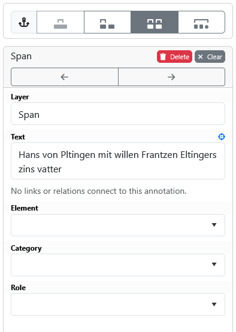

# 5.1. Projekt-Vorbereitung

Autor: Ismail Prada Ziegler
Bei Fragen zum Setup dürfen Sie sich gerne direkt bei [per Mail](ismail.prada@unibe.ch]) an mich wenden.

## Inception-Installation

Wichtig: Dieser Guide wurde basierend auf der INCEpTION-Version 38.6. geschrieben und getestet. Bei neueren Versionen könnten einige Details abweichen, aber wir empfehlen trotzdem immer die neueste Version zu verwenden, da Updates oft wichtige Bug-Fixes enthalten.

Wir empfehlen für die Annotation [INCEpTION](https://inception-project.github.io/) zu verwenden. Uns ist keine andere Plattform bekannt, die verschachtelte Annotation im selben Umfang unterstützt. INCEpTION bietet darüber hinaus auch eine Vielzahl von zusätzlichen Features, z.B. das Linking auf eine Knowledgebase während der Annotation, die Nutzung von Recommender-Modulen und die Infrastruktur für professionelles Projektmanagement. Der Nachteil ist, dass die Plattform selbst gehostet werden muss. Wer etwas technisches Know-How hat, sollte das aber ohne Probleme hinbekommen. Wir empfehlen, die Plattform auf einem Server zu installieren, aber theoretisch kann sie auch lokal betrieben und nur bei Bedarf eingeschaltet werden. Für eine Testumgebung kann man z.B. einen virtuellen Server bei [DigitalOcean](https://www.digitalocean.com/) mieten. 
Der Installationsprozess von INCEpTION wird im [Administrator-Guide](https://inception-project.github.io/releases/38.6/docs/admin-guide.html) ausführlich und im [User-Guide](https://inception-project.github.io/releases/38.6/docs/user-guide.html#_installing_and_starting_inception) in Kürze besprochen und wird hier nicht wiederholt. Folgen Sie am besten dem User-Guide und lesen Sie bei Fragen im Admin-Guide nach. Wir empfehlen, dass Sie sich den User-Guide vollständig durchlesen. Für den nächsten Schritt wird angenommen, dass INCEpTION installiert wurde, und läuft. Im Browser sollte die Plattform nun erreichbar sein und so aussehen:

## Aufsetzen des Projekts
Als Admin kann man neue Projekte erstellen. Wir empfehlen, den Admin-Account nur zum Erstellen des Projekts zu verwenden, und dann einen neuen User einzurichten, der als Projektmanager (und Kurator, Annotator, etc.) dienen kann. Der User-Guide beschreibt die Einrichtung von Usern [hier](https://inception-project.github.io/releases/38.6/docs/user-guide.html#sect_users). Wechseln Sie für die folgenden Schritte zum Projekt-Manager.

Klicken Sie auf **+ New Project**, als Grundlage für ein BeNASch-Projekt eignet sich die Vorlage **Basic annotation (span/relation)** gut. Als Projektmanager können Sie nun unter **Settings** Dokumente hochladen und das Projekt konfigurieren.

## Layer konfigurieren
Gehen Sie zum Bereich **Layers**. Das Post-Processing-Framework ist darauf ausgerichtet zwei Layer zu erwarten: *Span* und *Relation*. Im Span-Layer werden alle Annotation festgehalten, die direkt im Text verankert sind. Im Relation-Layer hingegen können Annotationen miteinander verbunden werden, z.B. um einfache Beziehungen oder Koreferenzen festzuhalten. 

Stellen Sie im Span-Layer fest, dass die *Granularity* auf **Token-level** gesetzt ist und *Overlap* auf **Any**. Erlauben Sie ausserdem **Allow crossing sentence boundaries**. Speichern Sie Ihre Änderungen mit dem *Save*-Button oben im Fenster.

In den *Features* rechts können wir festlegen, welche Felder zur Annotation wir standardmässig angezeigt haben möchten. Wir empfehlen folgende Feature mit den folgenden Settings einzurichten:

| Name    | Type               | Options           |
|---------|--------------------|-------------------|
| Element | Primitive: String  | Alle auf On       |
| Category   | Primitive: String  | Enabled, Curatable |
| Role    | Primitive: String  | Enabled, Curatable |

Tagset können Sie derzeit auf NONE lassen, wir werden diese als nächstes einrichten, und dann in den entsprechenden Features verlinken.

Sie können Role weglassen, falls Sie nicht vorhaben, komplexe Beziehungen und Ereignisse zu annotieren. Wenn Sie auch direkt auf eine Knowledge-Base verlinken wollen, können Sie ein Feature dazu ebenfalls einrichten, lesen Sie mehr zur Arbeit mit Knowledgebases im [User-Guide](https://inception-project.github.io/releases/38.6/docs/user-guide.html#sect_knowledge_base103).

Schalten Sie auch im Relation-Layer *Overlap* auf **Any** und aktivieren Sie **Allow crossing sentence boundaries**. Falls Sie Koreferenzen und Beziehungen trennen wollen, können Sie natürlich auch ein weiteres Layer vom Typ *Relation* einrichten und entsprechend konfigurieren.

## Tagsets vorbereiten
Wechseln Sie nun in den Reiter *Tagesets*. Hier können wir die Tagsets für die Feature definieren. Die Tagsets können dabei entweder offen gelassen, oder festgeschrieben werden (Aktivieren oder deaktivieren Sie *Annotators may add new tags* entsprechend). Richten Sie nun drei neue Tagsets ein, am besten mit den Namen der Feature + "labels". Für *Element labels* empfehlen wir die folgenden Tags festzuschreiben:

- ref (Erwähnung / Referenz)
- appo (Apposition)
- attr (Attribut)
- head (Kern / Kopf)
- list (Liste)
- num (Numeral)
- val (Wert)
- oth (Andere)
- unc (Unklar)
- unk (Unbekannt)

Falls Sie (komplexe) Ereignisse annotieren, brauchen Sie auch:

- trigger (Ereignis- oder Beziehungstrigger)
- mod (Zusatzinfo für Ereignisse und Beziehungen)
- interaction (Textspanne für Ereignisse und Annotationen)

Wir empfehlen die Tagsets Category und Role erstmal offen zu lassen und nach Bedarf zu füllen.

{: .note}
Warum sind die Tags auf englisch? Auch wenn BeNASch primär für und auf Deutsch konzipiert wurde, ist das Projekt auch ausserhalb des deutschsprachigen Raums auf Interesse gestossen. Um maximale Kompatibilität zu gewährleisten, empfehlen wir die Benennung von Tags auf Englisch.

Nachdem alle Tagsets angelegt sind, gehen Sie zurück zu *Layers* und wählen Sie für jedes Feature das entsprechende Layer aus.

## Dokumente hochladen
Gratulation! Damit ist das Projekt soweit konfiguriert. Laden Sie nun (am besten erstmal testweise ein paar wenige) Dokumente hoch. 
Wichtig: INCEpTION bietet viele Formate für den Upload. In diesem Mini-Guide empfehlen wir Ihnen den Upload in reinem Text-Format.
Falls Sie wichtige Informationen am Dokument beibehalten möchten, z.B. frühere Annotationen, oder Informationen zum Layout, empfiehlt sich ein Upload als UIMA CAS XMI oder UIMA CAS JSON. Wenn Sie Ihre Datei in diesem Format vorbereiten, können Sie sie später - mit den neuen Annotationen - auch wieder in diesem Format exportieren. Auch mit dem HTML-Format sollte es möglich sein, zusätzliche Informationen "mitzunehmen". Beachten Sie bitte, dass der Import von TEI nicht mehr aktiv unterstützt wird und [einigen Einschränkungen unterliegt](https://inception-project.github.io/releases/38.6/docs/user-guide.html#sect_formats_tei). Eine ausführliche Erklärung zur Aufbereitung von eigenen Dateien in UIMA CAS ist in diesem Guide nicht vorgesehen.

Für den Upload in Text-Format kommen drei Optionen in Frage:

- Plain Text: Wählen Sie diese, wenn Ihr Dokument nur minimal vorverarbeitet wurde. INCEpTION wird automatisiert versuchen Satz- und Tokengrenzen festzustellen.
- Plain Text (one sentence per line): Wählen Sie diese, wenn in ihrem Dokument bereits Satzgrenzen erkannt wurden, und das Dokument nun einen Satz pro Zeile enthält. INCEpTION wird eine einfache Tokenisierung durchführen, in der es z.B. Interpunktion tokenisiert.
- Plain Text (space-separated tokens, one sentence per line): Wenn Sie auch bereits eine eigene Tokenisierung und Satzgrenzenerkennung vorgenommen haben, dann können Sie dieses Format wählen.

In früheren INCEpTION-Versionen konnte "Plain Text" bei langen Sätzen und Annotationen sehr unpraktisch in der Darstellung sein, weshalb wir im Falle vom Historischen Grundbuch einfach die *(one sentence per line)*-Option gewählt haben. In neuen Versionen hat sich das verbessert, wir empfehlen aber mit einigen Dokumenten und den Import-Formaten zu experimentieren. Die Satzgrenzen können im Fall von langen Dokumenten bei der Verwendung von Recommendern wichtig sein, weshalb man sich das Format gut überlegen sollte.

## Testen
Klicken Sie nun **Dashboard**, dann auf **Annotation** und wählen Sie eines der hochgeladenen Dokumente aus. Markieren Sie mit der Maus eine Spanne im Text, sieht die rechte Sidebar so aus wie im Bild unten, sind Sie bereit um loszulegen:

*Bei Element sollten Sie im Dropdown auch die Tags sehen können. Wenn Sie anfangen zu schreiben, hilft Ihnen ein Autocomplete dabei, die Tags schneller eingeben zu können*

Im Kapitel 5.2. wird der Annotationsprozess im Detail besprochen, mit einigen Tipps, um Ihn effizienter zu machen.