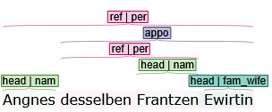
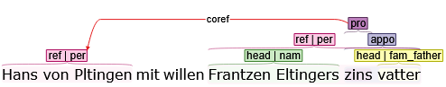
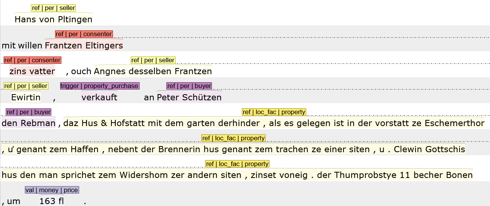
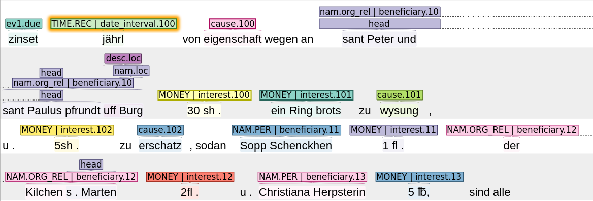
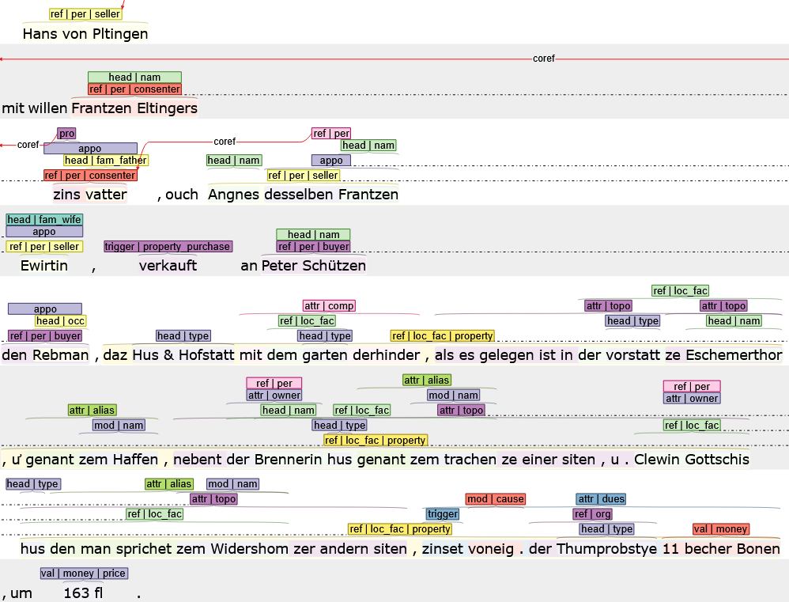

# 5.2. Annotation in INCEpTION

Autor: Ismail Prada Ziegler, Universität Bern [✉](ismail.prada@unibe.ch) [*ORCiD*](https://orcid.org/0000-0003-4229-8688)

In diesem Guide wird im Detail erklärt, wie ein Dokument in Inception annotiert werden sollte, damit es durch das BeNASch-assoziierte Postprocessing korrekt verarbeitet werden kann. Die hier empfohlene Methode der Annotation zielt darauf ab, möglichst keine "überflüssigen" Tags setzen zu müssen.

Es wird angenommen, dass ein Projekt nach den Empfehlungen in Kapitel 5.1. aufgesetzt wurde und die entsprechenden Layer "Span" und "Relation" vorhanden sind.

## User-Interface konfigurieren
Nach dem Öffnen des Dokuments kann mit dem kleinen Rädchen in der Bedienungsleiste das User-Interface konfiguriert werden. Stellen Sie die Schriftgrösse nach Ihrer Vorliebe ein und legen Sie fest, wie viele Zeilen oder Sätze jeweils aufs mal angezeigt werden sollen. In den *Annotation Layer Preferences* ist es ratsam, *dynamic* oder (meine Vorliebe) *dynamic pastelle* einzustellen, so werden die Tags unterschiedlich eingefärbt und sind übersichtlicher. Diese Einstellungen können jederzeit geändert werden und sind nutzerspezifisch, jeder im Team kann also seine eigenen Settings definieren.

## Textspannen annotieren

{: .note}
Wir empfehlen, die Anker-Einstellung oben rechts auf "Token-level" zu setzen. Dies ermöglicht etwas schnelleres Markieren der Textspannen, weil nicht exakt die Endungen der Wörter markiert werden müssen. Durch Doppelklick kann ein Token schnell angewählt und annotiert werden.

{: .note}
Wenn sich ein Kopf sich komplett mit seiner Erwähnung deckt, z.B. weil die Erwähnung nur ein Personenname ohne weitere Informationen ist, kann auf die Annotation des Kopfs verzichtet werden. Das Postprocessing sorgt dafür, dass der Kopf nachgereicht wird, und als Kernklasse die Klasse erhält, die als *default* für Kerne der entsprechenden Entitätenklasse hinterlegt ist in den Postprocessing-Konfigurationen. Für Personen z.B. ist die *default*-Kernklasse *nam*.

### Features und Labelkonstruktion

In unseren Features verwenden wir nur drei Eingabefelder.
Im ersten Eingabefeld wird die Art des Elements gewählt, z.B. *ref* für eine Erwähnung.
Im zweite Eingabefeld werden die Kategorien des Elements festgehalten, z.B. *per.grp* für eine Personengruppe. 
Die Eingaben für die Kategorien werden mit einem Punkt getrennt.

{: .note}
Zwei Zeichen haben in den Label-Eingaben eine spezielle Bedeutung: Der Punkt "." trennt Kategorien voneinander, z.B. *per.grp* (Person + Gruppe). Der Unterstrich "_" symbolisiert Unterkategorien, z.B. *loc_fac* (Ort - Gebäude).

Die erste Kategorie *muss* immer die Hauptklassifikation sein, also im Falle von Erwähnungen die Entitätenklasse, im Falle von Kernen die Kern-Klasse, etc. Das Postprocessing ist auf diese Reihenfolge angewiesen, wird davon abgewichen, muss das Postprocessing individuell angepasst werden. Das Feld kann auch ganz leer gelassen werden, dann muss aber für jedes Element in den Post-Processing-Einstellungen ein *default*-Wert definiert werden. Typische *default*-Werte für Hauptklassen sind z.B. *nam* für Personen, da diese meist mit dem Namen genannt werden. Für alle Klassifikationen abseits der Hauptklasse, z.B. Ordinalität und Spezifität sind *default*-Werte bereits hinterlegt.

Dran denken: Die optionalen Klassifikationen müssen nur annotiert werden, wenn sie vom Standard-Wert abweichen. Standard-Werte gelten wie folgt:

| Klassifikation | Standard-Wert |
| ----------- | ----------- |
| Ordinalität | Singular (*sgl*) |
| Spezifität | Spezifisch (*spc*) |

{: .note}
Im Postprocessing können die Standard-Werte in *coming soon* angepasst werden.

Wir empfehlen zudem, dem Tagset des Element-features ein Element *pro* hinzuzufügen. Damit können Pronomina speziell annotiert werden. Da Pronomina sowieso immer Koreferenzen aufweisen sollten, kann ihre Entitätenklasse einfach über die Koreferenz abgeleitet werden, und so kann das zweite Eingabefeld einfach leer gelassen werden.
Da der Kopf eines Pronomens immer die Klasse *pro* hat und sich mit der Erwähnung deckt, kann auch der Kopf später im Postprocessing ohne Aufwand nachgereicht werden.

## Koreferenzen und einfache Beziehungen (ohne Trigger) setzen
Wir können Koreferenzen und Beziehungen durch eine Linie zwischen zwei Erwähnungen darstellen. Dazu ziehen wir einfach mit gedrückter linker Maustaste den Pfeil von der einen Erwähnung zu der anderen Erwähnung und schreiben "coref" (oder eine entsprechende Beziehungsklasse) in das Feld "Label". Eine Lösung per ID (da die Pfeile den Bildschirm teils sehr unübersichtlich machen) ist in Arbeit, aber noch nicht im Postprocessing implementiert.

## Annotation von einfachen Beziehungen und Ereignissen in Verschachtelungen
Als "einfach" sind Zustände und Ereignisse zu verstehen, die nur aus zwei Rollen bestehen, und möglicherweise einem Trigger.

Falls sie in einer Verschachtelung vorkommen, müssen sie oft gar nicht explizit annotiert werden. Betrachten wir dieses Beispiel:

Die Annotation reicht aus, um abzuleiten, dass Agnes hier Ehefrau des Franz ist. Die Apposition dient dazu, diese Beziehung herzuleiten, während der Kern der Apposition die Klasse der Beziehung vermittelt. Das Postprocessing enthält die Möglichkeit, von der gerichteten Bezeichnung *fam_wife* zu einer ungerichteten Beziehung *married* zu kommen, und dabei dann den entsprechenden Entitäten die Rolle *wife* und *husband* zu geben. (Diese Transformation ist aber derzeit nicht standardmässig in den Konfigurationen enthalten!)
Attribute funktionieren auf genau dieselbe Weise, bei ihnen wird die Beziehungsklasse aber von der Attributsklasse direkt abgeleitet.

Bei Appositionen kann es selten vorkommen, dass die Kernklasse die Beziehung nicht beschreibt. In diesem Fall gibt es zwei Möglichkeiten: In der Klasse der Apposition die Beziehungsklasse festhalten, was dann statt der Kernklasse vom Postprocessing verwendet wird. Oder die Beziehung explizit oder komplex (siehe unten) zu annotieren.

Auch Ereignisse können auf diese Weise in verschachtelten Strukturen vorkommen, was aber seltener geschieht. Wenn Sie sicher stellen, dass Beziehungs- und Ereignisklassen getrennt bleiben (z.B. "married" für die Beziehung, "do_marry" für das Ereignis), können Sie im Postprocessing definieren welche Klasse als welches Konzept verarbeitet werden soll.

Wenn Entitäten übrigens eindeutig auf Rollen passen, können wir sogar Ereignisse mit mehr als zwei Rollen auf diese automatisierte Weise verarbeiten lassen. Siehe z.B. das *dues*-Attribut im vollständigen Beispiel am Schluss. Im Postprocessing muss dazu aber die automatische Zuweisung aller Elemente im Attribut definiert sein.

## Explizite Annotation von Zuständen und Ereignissen

### Zur Erinnerung
Ein Ereignis oder ein Zustand werden gemäss Projektspezifikation annotiert. In diesem Fall nehmen wir an, dass im Beispiel alle Elemente, Textspanne, Trigger und Rollen annotiert werden müssen. Alles im Folgenden gilt auch für die Annotation von Zuständen.

### Grundlegendes
Die Ereignis-Spanne word als *interaction*-Element ausgezeichnet. Als Kategorie setzen wir die Ereignis-Klasse.
Die Ereignis-Spanne kann weggelassen werden (wie im Beispiel unten) wenn vom Projekt erlaubt, dann setzt das Postprocessing die Spanne automatisch von der ersten Rolle/Trigger bis zur letzten Rolle/Trigger im Text. Ist unser Ereignis in einer Referenz, einer Apposition oder einem Attribut verankert, gilt dieselbe Textspanne wie das Anker-Element.

Der Trigger wird als *trigger*-Element ausgezeichnet. Als Kategorie setzen wir die Ereignis-Klasse. Ein Ereignis kann in seltenen Fällen ohne Trigger auftreten. Wird oder kann kein Trigger annotiert werden, empfiehlt es sich die Ereignis-Spanne zu setzen, um trotzdem den Ereignis-Typ angeben zu können. Existiert ein Anker-Element, kann der Ereignis-Typ vermutlich (je nach Projektspezifikation) vom Anker-Element abgeleitet werden.

Für Rollen verwenden wir das "Role"-Feature. Dort wird die Role einfach eingeschrieben. Auch Ereignis-Spannen und/oder Trigger können eine Rolle in einem anderen Ereignis erhalten.

*Im obigen Beispiel ist ein einfaches Kauf-Ereignis annotiert (ohne Ereignis-Spanne). Verschachtelte Annotationen wurden weggelassen um mehr Übersichtlichkeit in der Darstellung zuzulassen*

### Mehrere Ereignisse im selben Satz
Angenommen die Satzebene ist eure Annotationsebene (ansonsten ersetze hier "Satz" durch eure Annotationsebene, z.B. "Kapitel" oder "Dokument"), und mehrere Ereignisse kommen darin vor, müssen wir die Rollen und Trigger voneinander trennen. 
Wir verwenden dazu eine Nummerierung. 
Die ID für ein jeweiliges Ereignis wird dem Trigger oder der Ereignis-Spanne in das *Role*-Feld geschrieben. Den Rollen wird die ID jeweils angehängt, aus "seller" also z.B. "seller.0". Im seltenen Fall, dass mehr als 10 Ereignisse in einer Ebene vorkommen, muss ein weiterer Punkt hinter die Zahl gesetzt werden, zumindest bei den Rollen (z.B. "role.21.").

Findet ein weiteres Ereignis in einer anderen Annotationsebene statt, z.B. in einem Attribut einer Entitätenerwähnung, kann dieses ohne Nummerierung vom anderen Ereignis unterschieden werden. Die IDs der Ereignisse sind also Annotationsebenen-spezifisch.

### Ereignisgruppen
Jedes Ereignis gehört zu einer Ereignisgruppe. Die meisten Ereignisse stellen alleine ihre Gruppe dar. Wenn sich aber mehrere Ereignisse denselben Trigger teilen, gehören sie zur selben Gruppe. Manchmal teilen sie sich ebenfalls die eine oder andere Rolle. Die numerische Identifikation kommt hier wieder zum Zug.

*Hierbei handelt es sich um ein altes Beispiel, bitte ignorieren Sie die Annotationen abseits der Rollen. Ein neues Beispiel kommt sobald wie möglich*

Hier entstehen die folgenden Ereignisse als Teil derselben Ereignisgruppe:\
100: Jährlicher Zins von Eigenschaft wegen an St. Peter & St. Paulus Pfründ von 30 Sh.\
101: Zins zur Weisung an St. Peter & St. Paulus Pfründ von 1 Ring Brot.\
102: Zins zu Ehrschatz an St. Peter & St. Paulus Pfründ von 5 Sh.\
110: Zins an Sopp Schenken von 1 Gulden.\
120: Zins an St. Martin von 2 Gulden.\
130: Zins an Christiana Herbsterin von 5 Pfund.

### Anker-Elemente
Anker-Elemente ersparen uns doppelten Annotationsaufwand.
Einiges wurde schon erwähnt, explizit gilt: Ist kein Trigger annotiert, wird der Head des Anker-Attributs oder der Anker-Referenz vom Postprocessing als Trigger angenommen. In einer Setting-Datei (noch nicht implementiert) wird zudem weiteres automatisiertes Verhalten definiert, z.B. deutet ein Attribut der Klasse "due" nicht nur die Beschreibung des Zinsverhältnis innerhalb einer Hausbeschreibung an, sondern auch, dass das Haus die Rolle "property" im Ereignis erhält.

## Vollständiges Beispiel

