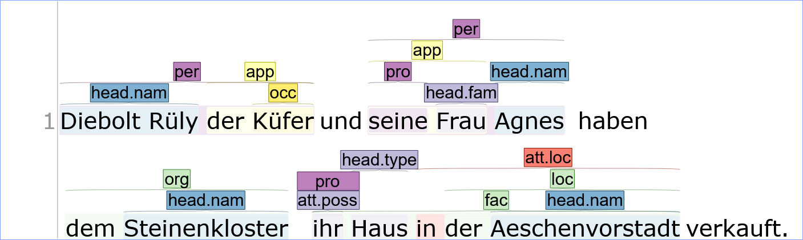
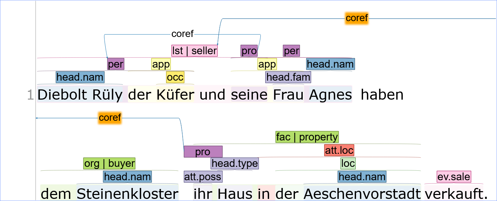
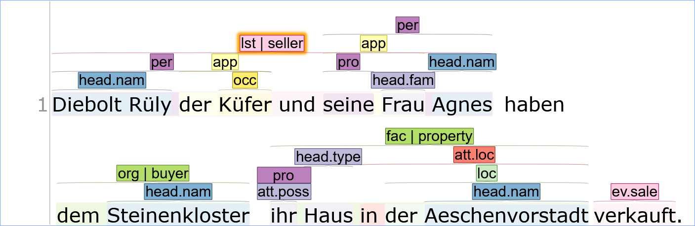

# 5.2. Annotation in INCEpTION

**BAUSTELLE: DIESER GUIDE IST AUF BASIS EINER ÄLTEREN VERSION DES SCHEMAS ENTSTANDEN UND WIRD DERZEIT ÜBERARBEITET.**

In diesem Guide wird im Detail erklärt, wie ein Dokument in Inception annotiert werden sollte, damit es durch das BeNASch-assoziierte Postprocessing korrekt verarbeitet werden kann. Die hier empfohlene Methode der Annotation zielt darauf ab, möglichst weniger "überflüssige" Tags setzen zu müssen.

Es wird angenommen, dass ein Projekt nach den Empfehlungen in Kapitel 5.1. aufgesetzt wurde und die entsprechenden Layer "Span" und "Relation" vorhanden sind.

## Entitäten annotieren

### Textspanne markieren

{: .note}
Wir empfehlen, das "Span"-Layer auf Token-basierte Annotation zu setzen. Dies ermöglicht etwas schnelleres Markieren der Textspannen, weil nicht exakt die Endungen der Wörter markiert werden müssen. Durch Doppelklick kann ein Token schnell angewählt und annotiert werden.

Im Schema wurde es zwar schon erwähnt, aber wir annotieren in diesem Schema immer "lange" Spannen. Das entspricht üblicherweise den Grenzen der jeweiligen [[Nominalphrase]](https://de.wikipedia.org/wiki/Nominalphrase). Es sollte ausserdem nicht vergessen werden, den Kopf (HEAD) zu markieren und zu annotieren (jede Entitätenerwähnung, egal ob Referenz oder Attribut, muss genau einen HEAD aufweisen!).

### Label setzen

Um den Annotationsprozess zu beschleunigen, verzichtet das Projekt darauf, für jede Klassifikation von Entitäten mehrere Felder zu verwenden. Stattdessen werden alle Informationen unter dem Feature "Label" verzeichnet. Die verwendeten Abkürzungen entsprechen denen, die im Schema jeweils in Klammern stehen.

Für Referenzen folgt diese Annotation dem folgenden Schema:
- Erwähnungs-Klassifikation
- Entitäts-Klassifikation
- Optional: Erwähnungs-Präzisierung
- Optional: Ordinalität
- Optional: Spezifität

z.B.: "**Hans Peter**" &rarr; NAM.PER\
z.B.: "das **Haus**" &rarr; NOM.LOC\
z.B.: "der **Schneider**" &rarr; NOM.PER.OCC\
z.B.: "**ihnen**" &rarr; PRO.PER.GRP

Attribute markieren wir durch ein "att", dieses impliziert zudem eine Entitäts-Klassifikation als NOM. Die Entitäts-Klassifikation, Ordinalität und Spezifität werden ebenfalls vom "Mutter"-Element geerbt und müssen daher nicht explizit annotiert werden. Danach können die übrigen optionalen Klassifikationen folgen:
- Optional: Erwähnungs-Präzisierung
- Optional: PRO oder NAM falls es sich nicht um ein NOM handelt

z.B.: "Hans Peter, [der **Schneider**]" &rarr; ATT.OCC\
z.B.: "die Herren, [**denen** Hans Peter noch schuldig ist]" &rarr; ATT.CREDITOR.PRO

Die optionalen Klassifikationen müssen nur annotiert werden, wenn sie vom Standard-Wert abweichen. Standard-Werte gelten wie folgt:
| Klassifikation | Standard-Wert |
| ----------- | ----------- |
| Erwähnungs-Präzisierung | Leer |
| Ordinalität | Singular (SGL) |
| Spezifität | Spezifisch (SPC) |

{: .note}
Im Postprocessing können die Standard-Werte in "schema_info.json" angepasst werden.

Pronomina können sogar noch weiter verkürzt werden, solange sie eine Koreferenz zu einem Label aufweisen, welches die vollen Informationen aufweist. Ein PRO reicht in dem Fall aus.

### Beispiel

Ein Dokument könnte nach diesem Schritt folgendermassen aussehen:

## Deskriptoren annotieren

### Textspanne markieren
Auch Deskriptoren sollten der Syntax des Satzes folgen. Es sollte nicht vergessen werden, dass auch Pronomina Entitätenerwähnungen darstellen, und daher nicht als Deskriptoren, sondern als Attribute zu annotieren sind.

Falls der Deskriptor ein Ereignis oder einen Zustand markiert, ist es in diesem Schritt bereits ratsam einen Trigger und etwaige Rollen zu markieren.

### Label setzen
Die Auswahl an möglichen Deskriptoren ist gross, da sie auch alle Typen von Relationen und Ereignissen abdeckt. Deskriptoren werden mit "desc" eingeleitet, danach folgt der Typus des Deskriptors.

### Beispiel
Ein Dokument könnte nach diesem Schritt folgendermassen aussehen:

## Koreferenzen setzen
Wir können Koreferenzen, durch eine Linie zwischen zwei Erwähnungen darstellen. Dazu ziehen wir einfach mit gedrückter linker Maustaste den Pfeil von der einen Erwähnung zu der anderen Erwähnung und schreiben "coref" in das Feld "Label". Eine Lösung per ID (da die Pfeile den Bildschirm teils sehr unübersichtlich machen) ist in Arbeit, aber noch nicht im Postprocessing implementiert.

## Annotation von einfachen Beziehungen und Ereignissen
Als "einfach" sind Zustände und Ereignisse zu verstehen, die nur aus zwei Rollen bestehen, und ev. einem Trigger.

Falls sie in einer Verschachtelung vorkommen, müssen sie oft gar nicht explizit annotiert werden.
Im Beispiel unten z.B. sehen wir die Beziehung vom Typus FAM im Attribut "seine Frau" enthalten. Das Postprocessing produziert daraus die Beziehung *"seine **Frau**" hat Beziehung FAM mit "**seine**"*. Also: das Postprocessing erzeugt eine beliebige Anzahl Beziehungen mit dem gleichen Typus wie dem des Attributs, welche das Attribut selbst mit allen Entitätenerwähnungen, die im Attribut stehen, verbinden.\
Die Wiedergabe durch Deskriptoren funktioniert ähnlich. Nur wird in diesem Fall die Entität, welche durch den Deskriptor beschrieben wird, mit der (oder den Entitäten), die innerhalb des Deskriptors stehen, verbunden. Im Beispiel unten wird also das "Haus & Hof" mit der "Aeschenvorstadt" durch eine Beziehung des Typus "loc" im Postprocessing generiert.\
Die Zuweisung der Rollen wird (coming soon) aus der Projektspezifikation abgeleitet. Bei einer gerichteten Beziehung wie OWNERSHIP z.B. können wir definieren, dass immer die beteiligte PER- oder ORG-Erwähnung die besitzende Rolle inne hat, während die LOC besitzt wird. Besteht Ambiguität, wie z.B. zwei ORGs in einer OWNERSHIP-Beziehung, müssen die Rollen explizit annotiert werden, ansonsten meldet das Postprocessing dies als eine Unklarheit, die händisch nachbearbeitet werden muss. Zur expliziten Annotation von Rollen siehe weiter unten.

Ausserhalb von Verschachtelungen können einfache Beziehungen / Ereignisse wie Koreferenzen per Pfeil markiert werden, das Label sollte dann den Typ der Beziehung wiedergeben.

### Beispiel
Ein Dokument könnte nach diesem Schritt folgendermassen aussehen:

## Explizite Annotation von Zuständen und Ereignissen

### Zur Erinnerung
Ein Ereignis oder ein Zustand werden gemäss Projektspezifikation annotiert. In diesem Fall nehmen wir an, dass im Beispiel alle Elemente, Textspanne, Trigger und Rollen annotiert werden müssen. Alles im Folgenden gilt auch für die Annotation von Zuständen.

### Grundlegendes
Die Ereignis-Spanne wird im "Label"-Feature mit dem Präfix "evspan" gekennzeichnet. Darauf folgt der Ereignis-Typus. 
Die Ereignis-Spanne kann weggelassen werden (wie im Beispiel unten) wenn vom Projekt erlaubt, dann setzt das Postprocessing die Spanne automatisch von der ersten Rolle/Trigger bis zur letzten Rolle/Trigger im Text. Ist unser Ereignis in einer Referenz, einem Attribut oder einem Deskriptor verankert, gilt dieselbe Textspanne wie das Anker-Element.

Der Trigger wird wie eine Entität oder Deskriptor gesetzt und im "Label"-Feature mit dem Präfix "ev" markiert. Ein Ereignis kann in seltenen Fällen ohne Trigger auftreten. Wird oder kann kein Trigger annotiert werden, empfiehlt es sich die Ereignis-Spanne zu setzen, um trotzdem den Ereignis-Typ angeben zu können. Existiert ein Anker-Element, kann der Ereignis-Typ vermutlich (je nach Projektspezifikation) vom Anker-Element abgeleitet werden.

Für Rollen verwenden wir das "Role"-Feature. Dort wird die Role einfach eingeschrieben. Auch Ereignis-Spannen und/oder Trigger können eine Rolle in einem anderen Ereignis erhalten.

### Mehrere Ereignisse im selben Satz
Angenommen die Satzebene ist eure Annotationsebene (ansonsten ersetze hier "Satz" durch eure Annotationsebene, z.B. "Kapitel" oder "Dokument"), und mehrere Ereignisse kommen darin vor, müssen wir die Rollen und Trigger voneinander trennen. Wir verwenden dazu eine Nummerierung. Aus "evspan" wird "evspan1", aus "ev" "ev0", aus "role" "role.0". Im seltenen Fall, dass mehr als 10 Ereignisse in einer Ebene vorkommen, muss ein weiterer Punkt hinter die Zahl gesetzt werden, zumindest bei den Rollen (z.B. "role.21.").

Findet ein weiteres Ereignis in einer anderen, tieferen Annotationsebene, z.B. in einem Deskriptor einer Entitätenerwähnung, statt, kann sie ohne Nummerierung vom anderen Ereignis unterschieden werden.

### Unter-Ereignisse
Unter-Ereignisse zeichnen sich dadurch aus, dass sie miteinander dieselbe Ereignis-Spanne und denselben Trigger teilen. Auch für Unterereignisse verwenden wir eine numerische Identifikation. Am einfachsten demonstrieren wir dies an einem Beispiel:

Hier entstehen die folgenden (Unter-)Ereignisse:\
100: Jährlicher Zins von Eigenschaft wegen an St. Peter & St. Paulus Pfründ von 30 Sh.\
101: Zins zur Weisung an St. Peter & St. Paulus Pfründ von 1 Ring Brot.\
102: Zins zu Ehrschatz an St. Peter & St. Paulus Pfründ von 5 Sh.\
110: Zins an Sopp Schenken von 1 Gulden.\
120: Zins an St. Martin von 2 Gulden.\
130: Zins an Christiana Herbsterin von 5 Pfund.

### Anker-Elemente
Anker-Elemente ersparen uns doppelten Annotationsaufwand.
Einiges wurde schon erwähnt, explizit gilt: Ist kein Trigger annotiert, wird der Head des Attributs oder der Referenz vom Postprocessing als Trigger angenommen. In einer Setting-Datei (noch nicht implementiert) wird zudem weiteres automatisiertes Verhalten definiert, z.B. deutet ein Deskriptor vom Typus "due" nicht nur die Beschreibung des Zinsverhältnis innerhalb einer Hausbeschreibung an, sondern auch, dass das Haus die Rolle "property" im Ereignis erhält.

### Beispiel

Ein Dokument könnte nach diesem Schritt folgendermassen aussehen:

