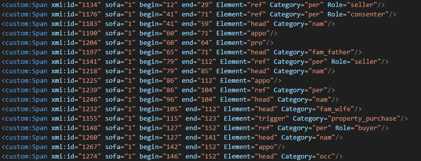
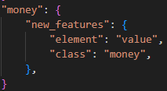
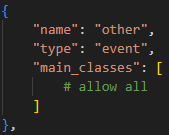

# 5.3. Postprocessing

Autor: Ismail Prada Ziegler, Universität Bern [✉](mailto:ismail.prada@unibe.ch) [*ORCiD*](https://orcid.org/0000-0003-4229-8688)

## Projekt exportieren
Als erstes müssen wir die Daten aus der INCEpTION-Datenbank rausbekommen. Dazu gehen Sie (mit Projektmanagerrechten) auf die **Settings**-Seite des Projekts, dann auf **Export**. Hier wählen Sie als sekundäres Datenformat **UIMA CAS XMI (XML 1.1)**, dann drücken Sie *Start export*. Es kann einen Moment dauern, bis der Download bereit ist, aber sobald er abgeschlossen ist, drücken Sie *Download*. Damit wir eine ZIP-Datei heruntergeladen.
Im ZIP-Ordner finden wir unter *annotation* einen Ordner für jedes Dokument im Projekt. Innerhalb des Ordners liegen wiederum eine ZIP-Datei pro Annotator:in, die das Dokument bearbeitet haben (als *bearbeitet* zählt dabei auch schon nur das Öffnen der Datei). Zusätzlich liegt darin ein ZIP-Ordner mit der unveränderten Datei (im CAS XMI-Format).
Wenn Sie den User-ZIP-Ordner öffnen, finden Sie die XMI-Datei selbst. Diese sieht ungefähr so aus:

XMI ist ein reines Standoff-Format, alle Informationen über Satzgrenzen, Tokengrenzen und Annotationen sind über *begin* und *end*-Attribute an die Zeichen des Textes geknüpft. Relations wiederum an Spans. Dieses Format wird durch das Postprocessing-Format nun zuerst in ein spezielles beNASch-XML umgewandelt, und alle Postprocessing-Schritte, die in den letzten Guides versprochen wurden, werden angewandt, damit das XML wirklich alle schema-relevanten Informationen enthält. Von diesem XML aus können wir dann die Dokumente in weitere Formate umwandeln, z.B. als Trainingsdaten für Machine Learning oder zu TEI.

## Das Postprocessing-Framework
Etwas Python-Kenntnis wird hier nun vorausgesetzt. Sollten Sie sich aber soweit an den Guide und die BeNASch-Vorgaben gehalten haben, sollten Sie nicht in den Code eingreifen müssen. Alle Anpassungen können Sie über die bereitliegenden Konfigurationsdateien oder in Konstanten zu Beginn der Skripte vornehmen.

Klonen Sie das [Postprocessing-Repository](https://github.com/raykyn/benasch-postprocess-publish) auf ihrem PC, oder laden Sie es herunter. 

Stellen Sie sicher, dass Sie eine geeignete Version von Python installiert haben. Ich teste den Code derzeit mit Version 3.13, aber alles ab 3.9 sollte gut zurechtkommen.
Zudem sollte die XML-Bibliothek [lxml](https://lxml.de/) installiert sein. (*ein richtiges Installationsskript ist geplant, aber noch nicht implementiert*)

## Ordnerstruktur vorbereiten
Suchen Sie den *data*-Ordner. Falls noch keiner existiert, erstellen Sie einen. Erstellen Sie im *data*-Ordner einen Ordner mit einem Namen Ihrer Wahl. Das ist Ihr Korpusordner. In diesem Ordner wiederum erstellen Sie einen *exports*-Ordner. In diesen Ordner schliesslich kopieren Sie ihr Projekt-ZIP, und entzippen es. Danach können Sie die gezippte Version löschen.
Falls Sie mehrere Projekte auf INCEpTION haben, die aber zum selben Datensatz gehören, können Sie noch weitere ZIPs in den *exports*-Ordner legen. Diese werden dann alle zusammen weiterverarbeitet.

## Dateien entzippen
Als ersten Schritt werden wir all die individuellen Dokumente entzippen. Der Vorteil, das zu tun anstatt direkt mit den gezippten Ordnern zu arbeiten, ist, dass wir auf diese Weise leichter händische Korrekturen in die XMI machen können. Passen Sie im Skript *unzip_export.py* die Einstellungen an, setzen Sie insbesondere *DATA* so, dass es auf Ihren Korpusordner zeigt. Führen Sie das Skript dann aus. Hat alles funktioniert, sollten Sie nun einen *unzipped*-Ordner im Korpusordner sehen, der für jedes TEI (pro Benutzer:in, die es bearbeitet hat) eine Datei enthält.

{: .note}
Mein Projekt (Ökonomien des Raums - siehe Beispielprojekte für mehr Informationen) hat damals keine Kuration im ordentlichen Sinne durchgeführt, deshalb sind die Skripte darauf nicht ausgerichtet. Es sollte aber eigentlich nicht viel mehr notwendig sein, als die Pfade leicht anzupassen, damit es auch mit Kuration funktioniert. Wir werden diesen Guide hoffentlich bei Gelegenheit damit ergänzen können.

## Umwandlung zu BeNASch-XML

### Konfiguration des Postprocessings
Im Ordner *postprocess_config* liegen mehrere Pyton-Skripte, die das Postprocessing-Skript *postprocess.py* konfigurieren. Diese Skripte sind in Python geschrieben, enthalten aber nur die Settings in Form eines Dictionaries (ähnlich wie JSON-Format, falls Sie mit Python nicht vertraut sind). Wir haben versucht, die Konfigurationen sinnvoll auf mehrere kürzere Dateien aufzuteilen. Öffnen Sie nun die Skripte im CONFIG-Ordner und sehen Sie sich an:

### defaults.py
In diesem Skript befinden sich einerseits Informationen über das Schema, sowie die *default*-Werte für heads je nach Entitätenklasse. 
Wenn Sie die üblichen BeNASch-Klassifikationen für Ordinalität, Spezifität, Zeitform, Polarität und Modalität verwenden, brauchen Sie unter *schema_info* keine Änderungen vorzunehmen.
Unter *head_defaults* können Sie die *default*-Werte wie benötigt anpassen. In der Beispieldatei z.B. sehen Sie dass für Persone und Geopolitische Entitäten jeweils ein Eigenname supplementiert wird, während für die anderen Entitäten *type* als Kernklasse vergeben wird.

### renaming.py
Wenn Sie während der Annotation feststellen, dass Sie dieselbe Information mal unter dieser und mal unter jener Klasse vermerkt haben, können Sie hier Umbenennungen anweisen.

### layer_processing.py
Dieses Skript ist das wichtigste. Falls Sie BeNASch und dem letzten Guide exakt folgen, müssen Sie hier keine Anpassungen vornehmen. Anonsten helfen die Kommentare in der Datei dabei, neue Konfigurationen einzurichten.
Am wahrscheinlichsten kommen Sie noc mit den Einträgen unter *span_features*/*label* in Kontakt. Hier sind für jedes Element Anweisungen eingetragen, wie es weiterverarbeitet wird. 
Ich mache hier ein Beispiel, wie Sie eine sinnvolle Erweiterung eintragen können:

Nehmen wir an, Sie möchten ein Element *money* erstellen, weil in Ihren Dokumenten Wertbeträge sehr häufig genannt werden. Dieses soll im Postprocessing aber zu einem Schema-konformen *value*-Element mit *money*-Klasse aufgelöst werden.
Legen Sie dazu einen neuen Eintrag auf derselben Ebene wie die anderen Elementklassen an (also unter dem Key *val* im aktuellen Skript). 
*new_features* handhabt konstante Klassen, also legen Sie diesen Key an, als Wert, wie auch bei *val* ein dictionary. Dort tragen Sie nun einfach die zwei Schlüssel-Wert-Paare *element*: *value* und *class*: *money* ein. 
Das war es auch schon!

### implied_interactions.py
In diesem Skript können Sie definieren, welche Rollennamen vergeben werden sollen im Fall von Interaktionen, die durch Verschachtelung implizit annotiert sind. Dadurch können auch schon relativ komplexe Interaktionen gut ausgelesen werden - solange sie nicht Teil von Ereignisgruppen sind. Gut sichtbar ist das am Beispiel des *due*-Ereignisses im Beispielskript.

### all_interactions.py
Dieses Skript sollte mindestens für jedes Ereignis vermerken, ob es sich dabei um einen Zustand oder ein Ereignis handelt. Das Skript kann aber auch bei der Validierung Ihrer Annotationen und kleineren Korrekturen aushelfen. Die Kommentare im Skript helfen Ihnen hoffentlich bei jeglichen Anpassungen, die Sie vornehmen wollen. Wenn Sie das Skript so minimal wie möglich halten wollen, tragen Sie einfach für jede Ihrer definierten Interaktionen einen Block wie diesen ein (entsprechend angepasst):

{: .note}
Denken Sie daran, dass Sie Ereignisse und Zustände meist sehr projekt-spezifisch sind. Passen Sie daher diese Dateien Ihren Bedürfnissen an. Das Skript wird Warnungen ausgeben, falls Rollen-Annotationen nicht mit einem Ereignis in Verbindung gebracht werden können.

## Umwandlung durchführen
Wenn Sie die Konfigurationen angepasst haben, öffnen Sie *process_export.py*. Passen Sie den *DATA*-Pfad wie schon bei *unzip_export.py* an. Führen Sie dann das Skript aus. 

In Ihrem Korpusordner sollte nun ein neuer Ordner liegen, *processed*, in dem die fertigen XML-Dateien liegen. Diese BeNASch-XML dienen in erster Linie als ein Standardformat zum Austausch und zur Weiterverarbeitung, sie haben aber auch den Vorteil, dass sie *relativ* gut menschenlesbar sind.

### Fehlerkorrektur
Sie werden im Terminal sehen, dass Ihnen das Skript einige Nachrichten ausgibt. Lassen Sie dieses Protokoll am besten in eine Datei schreiben ("python process_export.py > output.log" zum Beispiel).

Das Prokoll unterscheidet zwischen Fehlern (*ERROR*) und Warnungen (*WARNING*). 

Fehler sind gravierender. Sie bedeuten üblicherweise, dass etwas im Code überhaupt nicht verarbeitet werden konnte, z.B. weil etwas völlig falsch formatiert wurde. Fehler können z.B. ausgelöst werden weil zwei Spannen sich überlappen, ohne verschachtelt zu sein, oder dass eine Annotation überhaupt nicht verarbeitet werden kann, z.B. weil eine Rollen-ID zu keiner annotierten Interaktion gehört.

Warnungen hingegen weisen daraufhin, dass etwas nicht ganz stimmt, das Programm das aber ausreichend substituieren kann. Zum Beispiel, weil für einen Kern eine Klasse aus den defaults gesucht wurde, aber für die entsprechende Entitätenklasse kein *default* definiert wurde.

## Umwandlung in verschiedene Formate
*coming soon*