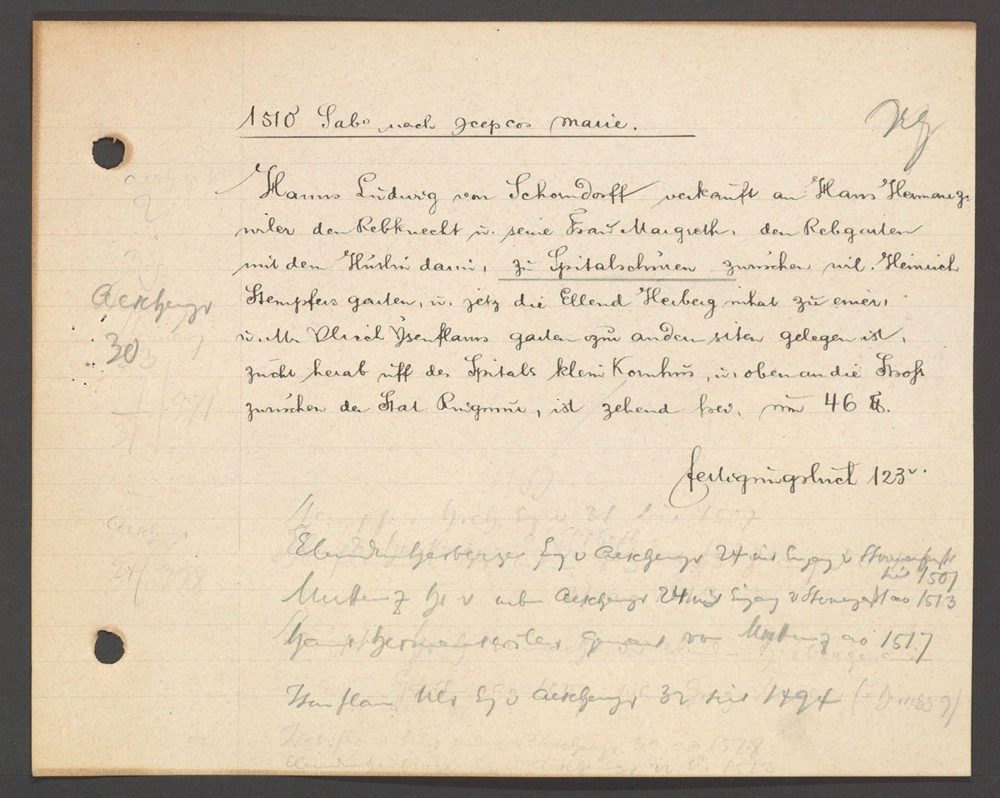

# Beispielprojekte

## Historisches Grundbuch der Stadt Basel

### Kontext
Als Teil des Projekts [Ökonomien des Raums. Praktiken, Diskurse und Akteure auf dem Basler Immobilienmarkt (1400-1700)](https://dg.philhist.unibas.ch/de/bereiche/mittelalter/forschung/oekonomien-des-raums/) entstand mit den Texten des Historischen Grundbuchs der Stadt Basel das erste BeNASch-annotierte Datenset. 
In vielerlei Hinsicht noch ein Prototyp weicht es in Teilen von den neuen BeNASch-Standards ab, dennoch sind die Daten in grossen Teilen BeNASch-kompatibel.
Das zugrundeliegende Grundbuch beschreibt Geschäfte und gerichtliche Vorgänge rund um Liegenschaften in der Altstadt von Basel. Die Aufmachung der Daten wird im Detail im Artikel [The Basel Land Records Ground Truth: An Annotated Dataset for Information Extraction on German-Language Administrative Records](https://openhumanitiesdata.metajnl.com/articles/10.5334/johd.387) beschrieben. Mit einem Umfang von 829 Dokumenten aus den Jahren zwischen 1400 und 1700 stellt das Datenset eine praktische Ressource zum Training und zur Evaluation neuer Annotationsmodelle dar.

*Eine typische Registerkarte aus dem Historischen Grundbuch der Stadt Basel, die den Verkauf einer Liegenschaft im Jahr 1510 beschreibt (Staatsarchiv Basel-Stadt HGB 11/34, S. 4).*

### Eckdaten

| **Eckdaten**       | **Details**                                                                 |
|---------------------|-----------------------------------------------------------------------------|
| Umfang          | 829 Dokumente, 54'926 Token, 30'020 Annotationen                          |
| Zeitraum        | 1400-1700 (grossteils 1400-1550)                                           |
| Sprache         | Frühneuhochdeutsch* (*siehe verlinkten Artikel für mehr Details)           |
| Region          | Stadt Basel                                                               |

### Datenrepository
[https://zenodo.org/records/16919653](https://zenodo.org/records/16919653)

### BeNASch-Version
Prototyp

### Erweiterungen
Das Datenset enthält eine wichtige *facility*-Entitätsklasse (FAC) um menschengemachte Strukturen zu annotieren, die als Unterklasse von LOC betrachtet werden kann.

Das Datenset enthält ausserdem eine Reihe von Ereignisklassen, die sich rund um die Geschäfte mit den Liegenschaften drehen. Diese Klassen können als Vorlage für andere Projekte aus ähnlichen Feldern dienen, oder für ein zukünftiges Grundbuch-Modul.

### Abweichungen
Bei Organisationen wurde der Kern oft über eine Spanne gesetzt, die nach dem neuen Standard aus Kern + Appositionen (oder mehreren Kernen, falls zugelassen), bestehen sollte. Attribute wurden nicht gemäss der Regel gesetzt, dass sie der Konstituenzgrammatik folgen. Was in einem einzelnen Attribut steckt, würde nach jetzigem Standard öfters in mehrere unterteilt werden.